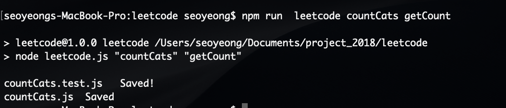

# leetcode_tester
run multiple test case with jest! 
(I use it to find out edge case when you cant access test input!)

If you already have node modules & jest in your test directory
all you need to do is add leetcode.js file and add script to package.json

//leetcode.js
```javascript
let fs = require('fs');

let fileName = process.argv[2];
let functionName = process.argv[3];

let jsExtension = '.js';
let jestExtension = '.test.js';
let fileContents = createFileContents(functionName);
let testContents = createTestContents(functionName, fileName);


let jsFileName = fileName + jsExtension;
let jestFileName = fileName + jestExtension;

fs.writeFile(jsFileName, fileContents , function (err) {
  if (err) throw err;
  console.log(jsFileName , ' Saved');
});

fs.writeFile(jestFileName, testContents, function (err) {
    if (err) throw err;
    console.log(jestFileName, '  Saved!');
});

function createFileContents(functionName){
    let fileContents = '';
    fileContents += `function ${functionName}() { \n } \n\n\n`;
    fileContents += `module.exports = ${functionName};`;
    return fileContents;
}

function createTestContents(functionName , fileName){
    let textContents = '';
    textContents += `const ${functionName} = require('./${fileName}'); \n\n`;
    textContents += `test('leetcode test', () => {   
      expect(${functionName}()).toEqual();\n`;  
    textContents += `});  \n `;
    return textContents;
}
```
package.json <= you need to add  "leetcode" : "node leetcode.js" script( and yes! off course you can change script & file name)
```
{
  "name": "leetcode",
  "version": "1.0.0",
  "description": "leetcode tester",
  "main": "index.js",
  "scripts": {
    "test": "jest",
    "leetcode" : "node leetcode.js"
  },
  "author": "",
  "license": "ISC",
  "devDependencies": {
    "jest": "^24.9.0"
  }
}

```

then run leetcode script with file, function name you want to create
ex) npm run  leetcode countCats getCount

```
npm run leetcode  {YOURFILENAME} {MAINFUNCTION}
```



Let's go to see what's is thos two file!

countCat.js
```javascript
function getCount() { 
 } 


module.exports = getCount;
```


countCat.test.js
```
const getCount = require('./countCats'); 

test('leetcode test', () => {   
      expect(getCount()).toEqual();
});  
 
```


once you add your function and test case, you should be able to run test!

```
npm test
```


